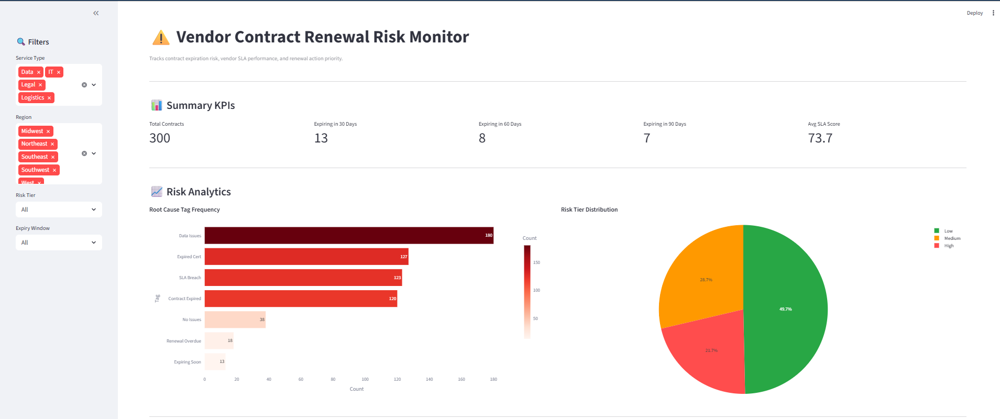
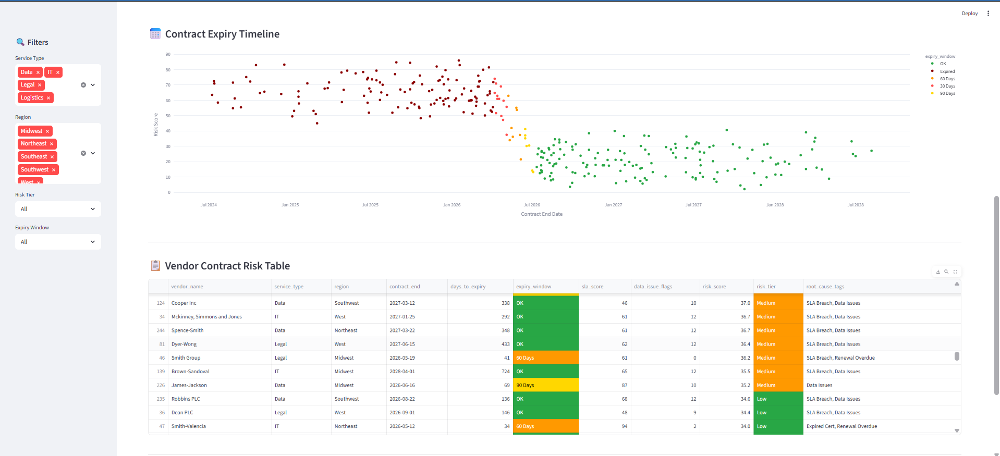

# ⚠️ Vendor Contract Renewal Risk Monitor

🔗 [](https://hari-vendor-contract-risk-monitor.streamlit.app)

A Streamlit dashboard that tracks vendor and supplier contracts

A Streamlit dashboard that tracks vendor and supplier contracts, flags renewal risk windows,
scores vendor risk across multiple operational signals, and exports Excel renewal action reports
— built to demonstrate compliance operations and supply chain analytics skills.

---

## Dashboard Preview





---

## What It Does

- Flags contracts expiring in **30 / 60 / 90 days** with color-coded urgency cells
- Scores each vendor on a **composite risk score** (SLA performance + data issue history + expiry urgency)
- Tags root causes per vendor: `SLA Breach` · `Data Issues` · `Expired Cert` · `Renewal Overdue` · `Contract Expired`
- Visualizes risk distribution with a **root cause bar chart**, **risk tier pie chart**, and **expiry timeline scatter plot**
- Exports a **3-sheet Excel report**: All Contracts · High Risk Only · Expiring in 90 Days
- Sidebar filters by Service Type, Region, Risk Tier, and Expiry Window — all charts and tables update live

---

## Tech Stack

| Tool | Purpose |
|---|---|
| Python | Core logic and data processing |
| Faker | Synthetic vendor contract data generation |
| Pandas | Data transformation, risk calculations, filtering |
| SQLite | Lightweight local contract database (single `.db` file) |
| Streamlit | Interactive web dashboard — no HTML/CSS needed |
| Plotly Express | Bar chart, pie chart, and scatter timeline |
| openpyxl | Multi-sheet Excel export |

---

## Project Structure

```
vendor-risk-monitor/
├── generate_data.py      # Generates 300 synthetic vendor contracts → saves to SQLite
├── risk_engine.py        # Risk scoring, expiry windows, root cause tagging logic
├── app.py                # Streamlit dashboard — all UI and chart rendering
├── assets/               # Screenshots for README
│   ├── dashboard_preview.png
│   └── table_preview.png
├── exports/              # Excel reports saved here (git-ignored)
└── README.md
```

---

## How to Run Locally

```bash
# 1. Install dependencies
pip install faker pandas streamlit openpyxl plotly

# 2. Generate synthetic vendor data (creates vendor_contracts.db)
python generate_data.py

# 3. Launch dashboard
streamlit run app.py
```

Open your browser at `http://localhost:8501`

---

## Risk Scoring Methodology

Each vendor receives a composite **risk score (0–100)** built from three normalized signals:

| Signal | Weight | Logic |
|---|---|---|
| SLA Performance | 30% | Inverted SLA score — lower SLA = higher risk |
| Data Issue Flags | 25% | Flag count normalized against dataset max |
| Expiry Urgency | 45% | Linear scale: 0 days left = 100, 90+ days = 0 |

Risk tiers: **High** (≥65) · **Medium** (35–64) · **Low** (<35)

---

## Root Cause Tags

| Tag | Trigger Condition |
|---|---|
| SLA Breach | SLA score < 70 |
| Data Issues | Data issue flags ≥ 5 |
| Expired Cert | Certificate expiry within 30 days |
| Expiring Soon | Contract ends within 30 days |
| Renewal Overdue | Days to expiry < renewal lead time |
| Contract Expired | Contract end date already passed |

---

## Skills Demonstrated

- Contract lifecycle tracking with renewal lead-time logic
- Composite risk scoring across multiple operational signals
- Root cause analysis tagging for flagged vendors
- Multi-sheet Excel reporting for stakeholder distribution
- Cross-functional filtering by service type, region, and risk tier
- Synthetic data generation for reproducible analytics demos

---

## Data

300 synthetic vendor contracts generated with Faker. Covers IT, Logistics, Legal, and Data
service types across 5 US regions. Some vendors carry multiple contracts (realistic variation).
Run `generate_data.py` to regenerate the dataset at any time.

---

*Built by [Hari Babu Ambati](https://linkedin.com/in/haribabuambati) · MSBA, Wichita State University*
